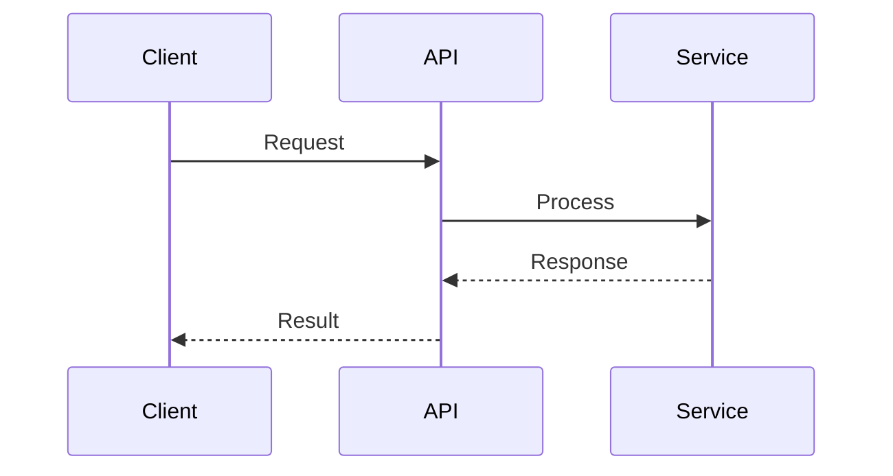

# CLAUDE.md

This file provides guidance to Claude Code when working in this repository.

## Repository Purpose

**SchemaBounce Bridge** is a standalone binary that orchestrates CDC (Change Data Capture) streaming from databases to the SchemaBounce platform. It supports three capture modes:

| Mode | Database | Method | Latency |
|------|----------|--------|---------|
| `wal` | PostgreSQL | Logical Replication | ~milliseconds |
| `mysql_outbox` | MySQL/MariaDB | Polling | ~3 seconds |
| `mssql_outbox` | SQL Server | Polling | ~3 seconds |

## Architecture Documentation

**Comprehensive architecture documentation**: [`/mnt/c/git/core-api/docs/OUTBOX_PATTERN_ARCHITECTURE.md`](/mnt/c/git/core-api/docs/OUTBOX_PATTERN_ARCHITECTURE.md)

This document covers:
- Complete data flow diagrams
- CDCEvent data structure
- Cursor management
- Batch sender with retry logic
- Configuration reference
- Database setup guides
- Deployment (Docker/Kubernetes)
- Monitoring and troubleshooting

## Quick Start

```bash
# PostgreSQL WAL mode
BRIDGE_MODE=wal \
DB_HOST=postgres DB_PORT=5432 DB_NAME=mydb \
DB_USER=replication_user DB_PASSWORD=secret \
REPLICATION_SLOT=schemabounce_slot \
API_ENDPOINT=http://ingest:8082/cdc/events \
./bridge

# MySQL Outbox mode
BRIDGE_MODE=mysql_outbox \
MYSQL_OUTBOX_HOST=mysql MYSQL_OUTBOX_DATABASE=mydb \
MYSQL_OUTBOX_USER=root MYSQL_OUTBOX_PASSWORD=secret \
API_ENDPOINT=http://ingest:8082/cdc/events \
./bridge

# MSSQL Outbox mode
BRIDGE_MODE=mssql_outbox \
MSSQL_OUTBOX_HOST=sqlserver MSSQL_OUTBOX_DATABASE=mydb \
MSSQL_OUTBOX_USER=sa MSSQL_OUTBOX_PASSWORD=secret \
API_ENDPOINT=http://ingest:8082/cdc/events \
./bridge
```

## Key Components

| Component | Purpose |
|-----------|---------|
| `wal_consumer.go` | PostgreSQL logical replication consumer |
| `outbox_poller.go` | MySQL outbox polling |
| `mssql_outbox_poller.go` | MSSQL outbox polling |
| `cursor_manager.go` | Position tracking and persistence |
| `sender.go` | Batch sending with retry and circuit breaker |


---

## 🔌 Claude Plugin Marketplace Integration

This repository is integrated with the Claude Plugin Marketplace for enhanced AI assistance.

**Marketplace Location**: `/mnt/c/git/claude-plugin/`

### 🛡️ Active Skills (Auto-Activate)

Skills automatically enforce best practices when you interact with Claude:

1. **kolumn-enforce** - Prevents direct SQL, enforces Kolumn HCL
2. **terraform-only-enforcer** - Blocks manual infrastructure commands
3. **frontend-orphan-preventer** - Ensures API/frontend synchronization  
4. **k8s-manifest-validator** - Validates Kubernetes manifests
5. **argocd-sync-helper** - Diagnoses ArgoCD sync issues
6. **helm-chart-enforcer** - Validates Helm charts
7. **agent-orchestrator** - Automated feature pipeline
8. **frontend-data-ux** - Data professional UX patterns
9. **git-branching-enforcer** - Git branching strategy
10. **provider-e2e-testing** - Comprehensive provider testing

### 📚 Documentation

- Skills & MCP: `/mnt/c/git/claude-plugin/SKILLS_AND_MCP_MARKETPLACE.md`
- Agent Specs: `/mnt/c/git/claude-plugin/AGENT_SPECIFICATIONS.md`
- Skills Manifest: `/mnt/c/git/claude-plugin/skills/SKILLS_MANIFEST.json`


---

## 🎯 Assessment Workflow Integration

**This repository uses the Claude Code Assessment Workflow from the marketplace.**

### 📦 Marketplace Location
`/mnt/c/git/claude-plugin/`

### 🏥 Dr. House Brutal Honest Assessor

**Available Commands**:
- `/assess` - Run comprehensive code assessment
- `/review` - Alias for /assess
- `code review` - Trigger assessment

**What It Does**:
- Evidence-based code quality validation
- 100-point rubric scoring (Code Quality, Architecture, Implementation, Professionalism)
- Automatic GitHub issue creation for all findings
- Detection of anti-patterns, security vulnerabilities, performance issues

**Features**:
- ✅ Rubric scoring (4 categories × 25 points = 100 total)
- ✅ Auto-creates GitHub issues (labeled: `dr-house`, `assessment`)
- ✅ Severity prioritization (CRITICAL → HIGH → MEDIUM → LOW)
- ✅ Epic 16 pattern detection (import path mismatches)
- ✅ Mock test detection
- ✅ Security vulnerability scanning

### 🤖 GitHub Issue Automator

**Auto-Creates Issues From**:
- Assessment findings
- Code review results
- Quality checks

**Issue Format**:
- Severity level (CRITICAL/HIGH/MEDIUM/LOW)
- Evidence (exact code snippet)
- Problem description
- Fix required (actionable steps)
- Example fix (code sample)
- Verification checklist

### 📊 Assessment Workflow

```bash
# 1. Run assessment
User: "/assess"

# 2. Dr. House analyzes code
- Scans codebase
- Runs tests and verifies
- Detects anti-patterns
- Security scan
- Performance analysis

# 3. GitHub issues created automatically
- All findings → GitHub issues
- Labeled and prioritized
- Actionable fixes included

# 4. Work on issues (PRIORITIZE ASSESSOR ISSUES FIRST)
- Fix CRITICAL issues first
- Then HIGH priority
- Re-assess to verify improvement
```

### 🎯 Key Features

**Evidence-Based**:
- No assumptions, only verified findings
- Runs actual tests, checks imports
- Detects real issues

**Automatic Issue Creation**:
- Every finding → GitHub issue
- Batch creation with rate limiting
- Comprehensive issue templates

**Prioritization**:
- ⚠️ **CRITICAL** - Production blockers, security vulnerabilities
- ⚠️ **HIGH** - Major bugs, significant technical debt
- 📋 **MEDIUM** - Code quality issues, missing tests
- 📋 **LOW** - Style issues, minor improvements

### 📚 Documentation

**Marketplace Documentation**:
- `/mnt/c/git/claude-plugin/README.md` - Overview
- `/mnt/c/git/claude-plugin/DR_HOUSE_ASSESSMENT_2025-01-13.md` - Example assessment
- `/mnt/c/git/claude-plugin/ASSESSMENT_WORKFLOW_COMPLETE.md` - Complete guide

**Skill Documentation**:
- `/mnt/c/git/claude-plugin/skills/brutal-honest-assessor/` - Skill details
- `/mnt/c/git/claude-plugin/skills/github-issue-automator/` - Automation details

### 🚨 Important Rules

1. **PRIORITIZE ASSESSOR ISSUES** - Work on Dr. House findings FIRST
2. **Fix CRITICAL within 24 hours** - Security/production blockers
3. **Re-assess after fixes** - Verify score improvement
4. **Target score: 85+** - Maintain quality standards

### 🏥 Dr. House's Standing Reminder

> "Evidence, not assumptions. Tests, not faith. If the assessment says it's broken, it's broken. Fix it, verify it, move on."

---

**Assessment Workflow**: ✅ Active
**Skills**: brutal-honest-assessor (v1.0.0), github-issue-automator (v1.0.0)
**Maintained By**: SchemaBounce Platform Team

---

## 🐹 Go Code Hygiene Standards

**This project follows Go code hygiene standards enforced by `/go-hygiene`.**

### Mandatory Checks (Run Before Commit)

```bash
# Format code
gofmt -w ./...
goimports -w ./...

# Static analysis
go vet ./...

# Lint (if golangci-lint installed)
golangci-lint run --timeout=5m

# Tests with race detection
go test -race ./...

# Module hygiene
go mod tidy
```

### Error Handling Rules

```go
// CORRECT: Always check and wrap errors
result, err := doSomething()
if err != nil {
    return fmt.Errorf("doSomething failed: %w", err)
}

// FORBIDDEN: Never ignore errors
result, _ := doSomething()  // NEVER DO THIS
```

### Naming Conventions

| Type | Convention | Example |
|------|------------|---------|
| Exported | PascalCase | `ProcessOrder`, `UserService` |
| Unexported | camelCase | `processOrder`, `userCount` |
| Constants | PascalCase | `MaxRetries`, `DefaultTimeout` |
| Interfaces | -er suffix | `Reader`, `Writer`, `Processor` |

### Context Rules

```go
// CORRECT: Context as first parameter
func ProcessData(ctx context.Context, data []byte) error

// WRONG: Context not first
func ProcessData(data []byte, ctx context.Context) error
```

### Documentation Requirements

| What | When | Format |
|------|------|--------|
| Exported functions | Always | GoDoc comment above function |
| Packages | Always | `doc.go` file |
| Complex logic | When non-obvious | Inline comments + Mermaid diagram |
| Architecture | New features | Mermaid diagram in docs/ |

### Mermaid Diagram Standards

Use Mermaid diagrams for:
- **Sequence diagrams**: API flows, multi-service interactions
- **State diagrams**: Entity lifecycle, state machines
- **Architecture diagrams**: Component relationships

Place in `docs/` directory or README.md:

```markdown
# Example: Sequence Diagram

```

### Post-Assessment Integration

After running `/assess` or `/review`, Go projects automatically trigger:
1. `gofmt -l ./...` - Format check
2. `go vet ./...` - Static analysis
3. Summary of Go-specific findings

Run `/go-hygiene` for full detailed report.

### golangci-lint Configuration

Create `.golangci.yml` in project root:

```yaml
run:
  timeout: 5m

linters:
  enable:
    - errcheck
    - govet
    - staticcheck
    - gofmt
    - goimports
    - gosec
    - contextcheck

linters-settings:
  govet:
    check-shadowing: true
  errcheck:
    check-type-assertions: true
```

---

---

## E2E Testing

This repo has access to the **platform-e2e-tester** skill for end-to-end testing.

### Slash Commands
- `/e2e-platform` - Full platform E2E test
- `/e2e-frontend` - Frontend-focused E2E
- `/e2e-api` - API E2E test
- `/e2e-etl` - ETL pipeline E2E

### Requirements
- Uses K8s API (NOT localhost)
- Runs restart-all.sh first
- Creates REAL Redis + Stream Worker pods
- Frontend configuration via chrome-devtools

See: `/mnt/c/git/claude-plugin/skills/platform-e2e-tester/SKILL.md`
